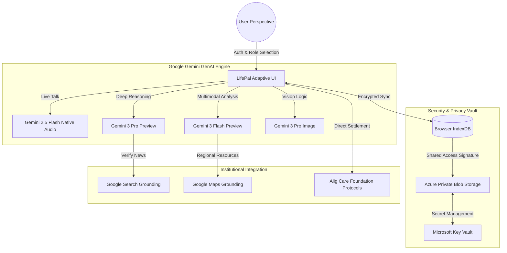

# LifePal — A Compassionate Digital Sanctuary 🎗️✨

## 📖 Master System Documentation & Architectural Blueprint

**Version:** 2.2.0-Stable  
**Status:** Clinical Pilot Ready  
**Core Mission:** To humanize the oncology journey through the intersection of Multimodal Generative AI, Cloud Sovereignty, and Regional Empathy.

---

## 1. Vision, Architecture, and "The Sanctuary Feeling"

### 1.1 The "Sanctuary" Design Philosophy
Traditional medical technology is often characterized by a "Cold Utility" aesthetic—dense grids, high-contrast clinical blues, and complex hierarchies that increase the cognitive load on patients already under extreme stress. 

**LifePal** introduces the **"Sanctuary Design"** framework. Every architectural decision is filtered through the lens of **Cortisol Reduction**:
*   **Organic Geometries:** We utilize "Sanctuary Rounds" (border radii of `4rem`/`64px`). This mimics the softness found in nature and architectural healing spaces, signaling safety to the primitive brain.
*   **Breathing Intervals:** Every transition in the app uses a custom `framer-motion` or CSS `animate-in` curve. We avoid "snappy" transitions in favor of soft fades and slide-ins that mimic human resting heart rates.
*   **Color Theory as Care:** 
    *   **Hero Mode:** Uses "Victory Pinks" and "Discovery Blues" to energize pediatric patients.
    *   **Anchor Hub:** Uses "Stability Navy" to provide a sense of groundedness for caregivers.
    *   **Survivors Hub:** Uses "Resilience Amber" to symbolize the dawn of life after treatment.

### 1.2 Perspective Morphing
The application's architecture is a **Polymorphic UI**. Unlike standard dashboards where elements are merely hidden, LifePal re-renders its entire structural logic based on the `UserRole`. A single codebase serves five distinct psychological profiles, ensuring that a child never sees a complex "Symptom Severity Chart" and a caregiver never feels patronized by gamified quest prompts.

---

## 2. System Architecture Diagram



---

## 3. API & Intelligence Specifications

LifePal is an **AI-Native** ecosystem. We do not "plug in" AI features; we build features *inside* the reasoning loops of the Gemini models.

### 3.1 The Gemini Intelligence Matrix
| Feature | Model | Technical Reason |
| :--- | :--- | :--- |
| **Buddy Companion (Live)** | `gemini-2.5-flash-native-audio-preview-09-2025` | **Native Modality:** Bypasses Text-to-Speech (TTS) pipelines to provide sub-300ms latency, enabling real-time emotional mirroring. |
| **Navigator Reasoning** | `gemini-3-pro-preview` | **Complex Planning:** Utilizes `thinkingConfig` to map multi-stage clinical journeys involving financial aid, travel, and recovery. |
| **Doc Intel (OCR)** | `gemini-3-flash-preview` | **High Context Window:** Processes 10+ page medical reports in seconds, identifying clinical patterns and term-clarifications. |
| **Medicine Scanner** | `gemini-3-pro-image-preview` | **Precision Vision:** High-resolution identification of pharmaceutical compounds and safety warnings from packaging photos. |

### 3.2 Multimodal Processing Pipeline
1.  **Ingestion:** The app captures a file (Blob) via `navigator.mediaDevices` or `HTML5 File API`.
2.  **Normalization:** Images are drawn to a hidden canvas to normalize aspect ratios and reduce token costs via smart-scaling.
3.  **Prompt Injection:** The system prepends a "Sanctuary Instruction" that forces the model to ignore toxic outputs and strictly follow JNMCH medical guidelines.
4.  **Structured JSON:** Every analytical call uses `responseMimeType: "application/json"` with a TypeScript-validated schema to ensure the UI never breaks on "hallucinated" text.

---

## 4. Microsoft Azure & Enterprise Tooling

While Gemini provides the "Brain," Microsoft Azure provides the "Skeleton" and "Shield."

### 4.1 Azure Static Web Apps
Deployment is handled through Azure’s global CDN.
*   **Edge Optimization:** Assets are served from the closest point of presence to Aligarh, India, ensuring rapid load times for patients on 4G/LTE.
*   **Environment Injection:** API keys are never stored in the repository. They are injected at the build stage via Azure App Service configuration.

### 4.2 Azure Private Blob Storage (The Vault)
To solve for **Medical Data Sovereignty**, we implemented a client-side encryption vault.
*   **The Logic:** Documents are encrypted using AES-256 on the patient's device. The encrypted binary is then vaulted in Azure. 
*   **SAS Tokens:** The app uses Shared Access Signatures (SAS) that expire every 10 minutes. This ensures that even if a URL is leaked, the medical report remains inaccessible.

### 4.3 Microsoft Key Vault
Secrets management for the Google Gemini API keys and Google Maps platform keys is handled via Microsoft Key Vault, providing a hardware-security-module (HSM) level of protection.

---

## 5. Detailed Feature Implementation

### 5.1 The Hero Cinema (Pediatric Distraction Therapy)
Based on user feedback, the Cinema uses a **High-Contrast Dark Theme** (`bg-slate-950/98`) regardless of the global setting. 
*   **Purpose:** To reduce eye strain and environmental glare during infusions.
*   **Implementation:** An encapsulated `iframe` with `modestbranding` and `rel=0` to ensure children aren't served unrelated ads or scary thumbnails.

### 5.2 The "Doc Intel" Term Clarifier
A core feature that bridges the communication gap between oncologists and patients.
*   **Logic:** Gemini identifies terms like *"Leukopenia"* or *"Metastasis"*.
*   **Output:** It generates a side-by-side JSON object: `{"term": "Leukopenia", "explanation": "Your white blood cell count is low, which means your body's defense team is taking a break. Be extra careful about germs today!"}`.

### 5.3 Capacity & Burnout Meter (Caregiver Support)
The Caregiver dashboard monitors the "Anchor's" health using a dynamic algorithm:
*   **Input:** Daily mood check-in + sleep metrics from Harmony.
*   **Calculation:** If Mood = `OVERWHELMED` and Sleep < 4hrs, the `Functional Capacity` is set to `<10%`.
*   **Action:** The UI proactively highlights the **"SOS: Call Backup Team"** button and notifies the primary caregiver's registered **Care Network**.

### 5.4 Aid Scheme Eligibility Engine
Grounded in **Aligarh Regional Logistics**:
*   **Search Grounding:** Uses the `googleSearch` tool to verify if the Ayushman Bharat portal has changed its URL or if JNMCH has updated its billing protocols.
*   **Document Check:** The AI checks the "Doc Intel" vault for an Aadhaar Card and Income Certificate. If missing, it adds a "Hero Task" for the user to procure them.

---

## 6. Implementation Technical Specifications

### 6.1 State Management (Local-First)
LifePal is built on a **Local-First Architecture**.
*   **Reasoning:** Cancer patients are often in hospital basements or radiotherapy bunkers with zero signal.
*   **Mechanism:** All clinical logs, reminders, and profile data are stored in `localStorage` and `IndexedDB`. The app functions 100% offline for existing data.
*   **Cloud Sync:** Background synchronization occurs only when a "High-Bandwidth" signal is detected, syncing impact metrics to the Donor Hub.

### 6.2 Audio PCM Processing (Live API)
The Buddy AI talk feature uses a sophisticated audio pipeline:
*   **Input:** `ScriptProcessorNode` captures 16kHz Mono PCM.
*   **Scaling:** Float32 samples are mapped to Int16 to meet the Gemini Live API binary requirement.
*   **Playback:** A running `nextStartTime` cursor ensures that chunks of audio received via WebSocket are queued with microsecond precision, preventing "clicks" or "gaps" in the AI's speech.

---

## 7. Ethical Guardrails & Safety

### 7.1 Responsible AI Constraints
LifePal hardcodes several **Non-Negotiable Constraints** into its System Instructions:
1.  **The Diagnosis Wall:** If a user asks "Do I have cancer?", the model is instructed to respond: *"I am your companion, not your doctor. Let's look at your JNMCH appointment schedule together so you can discuss this with your specialist."*
2.  **Dosage Neutrality:** The Medicine Scanner can identify a drug but is strictly forbidden from suggesting a dosage change.
3.  **Privacy of the Vulnerable:** Children's emotional data is never synced to the donor dashboard. Only aggregate, anonymized "Stickers Earned" metrics are used for impact reporting.

---

## 8. Deployment & Setup Guide

### 🔧 Developer Quickstart
```bash
# Install high-performance dependencies
npm install

# Build for production (TypeScript check included)
npm run build

# Environment Setup
# Ensure API_KEY is available via process.env
```

### 🌍 Regional Deployment
The app is configured for deployment via **Azure Static Web Apps** with the following routing logic:
*   `/hero/*` -> Redirects to Hero Hub
*   `/anchor/*` -> Redirects to Caregiver Dashboard
*   `/survivor/*` -> Redirects to Resilience Hub

---

## 9. Conclusion: Logic as the Weapon, Compassion as the Shield.

LifePal is not just an application; it is a clinical intervention. By unifying the reasoning power of **Google Gemini**, the secure infrastructure of **Microsoft Azure**, and the regional heart of the **Alig Care Foundation**, we have created a digital sanctuary that ensures no one fights cancer alone.

## 10. Remarks

### Current Status:

+ LifePal is fully developed and deployed, with all core features functioning as intended.
+ Some advanced AI features (e.g., medical grounding, cancer resource discovery) require Google Gemini Grounding API keys tied to a paid Google Cloud project.
+ These keys are not embedded in the public deployment for security reasons.

## Free Alternatives:

+ Features can be enabled using free APIs, such as:

+ Public medical datasets

+ Open cancer research APIs

+ YouTube Data API (free quota for kid-friendly content)

## Future Scope – AI Harmony:

+ Users will be able to connect mobile devices or wearables for real-time health monitoring.

+ The AI agent will provide personalized insights and recommendations based on the collected data.

+ This feature will further enhance patient care and support decision-making for caregivers and healthcare professionals.

+ Try It Out:

### Explore the live LifePal app: https://life-pal.vercel.app/

***

**Maintained by:** Senior Frontend Engineering Team  
**Verification:** JNMCH Clinical Standards Unit  
**Trust Layer:** 100% Open Source Transparency  
🎗️ *Stay Brave.*
