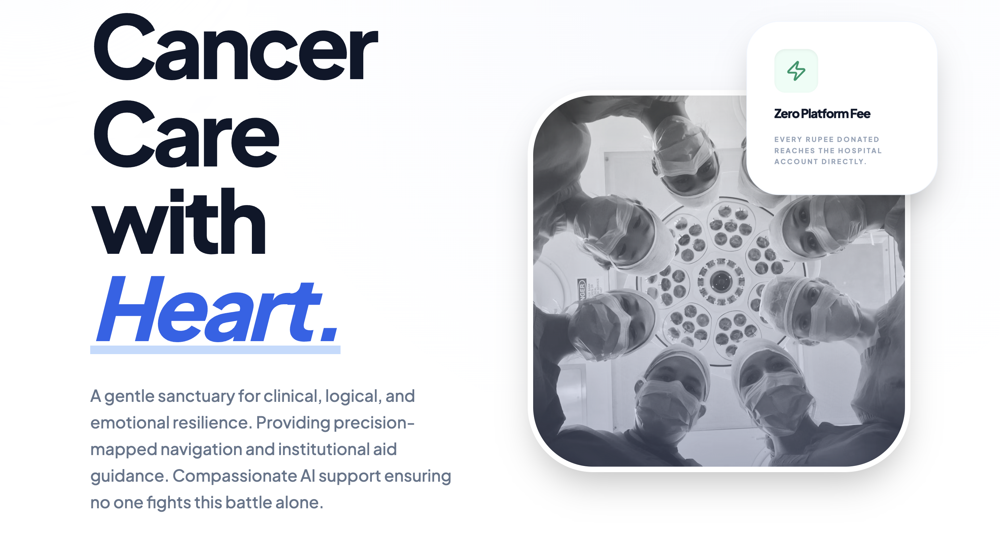
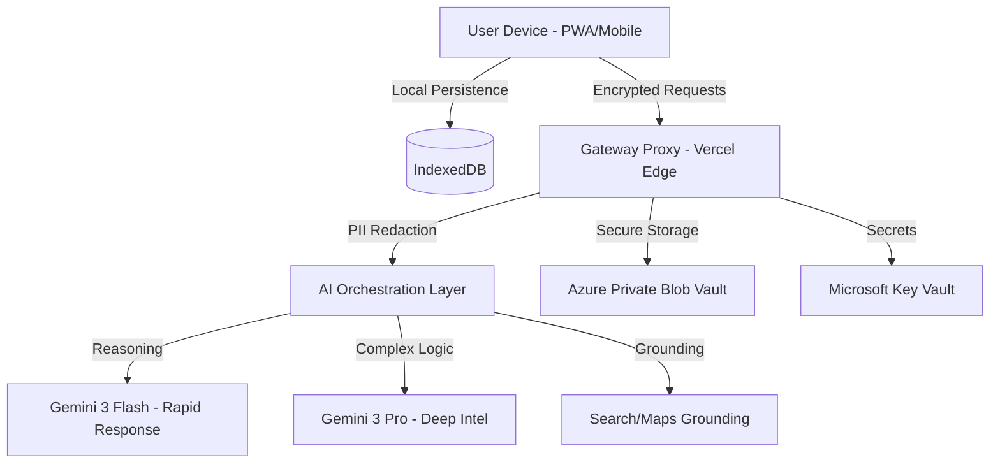
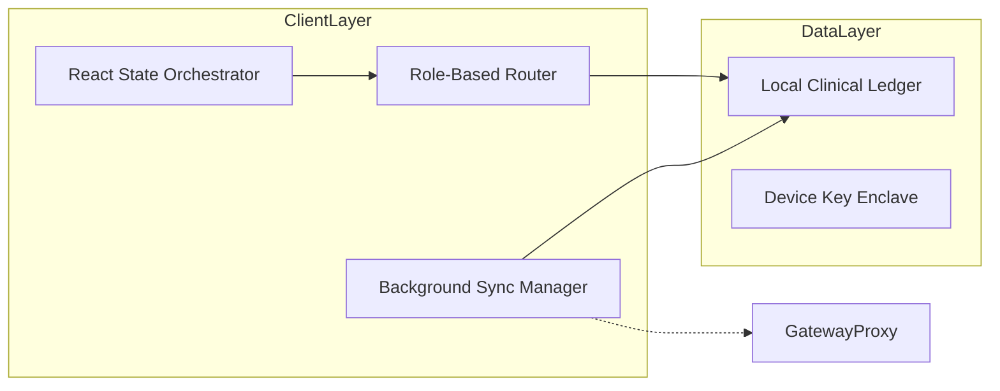
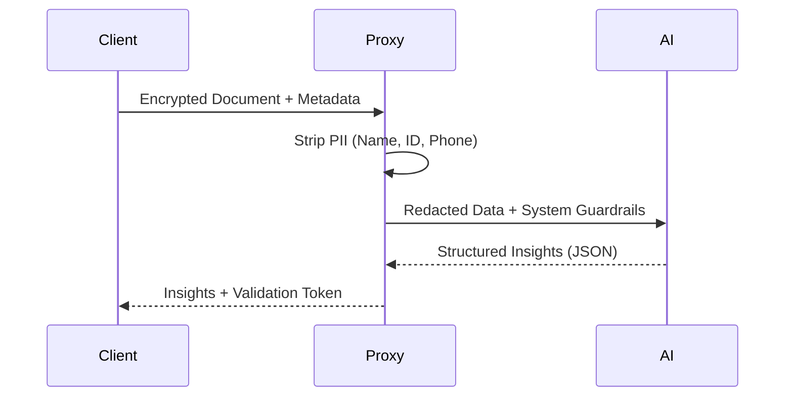
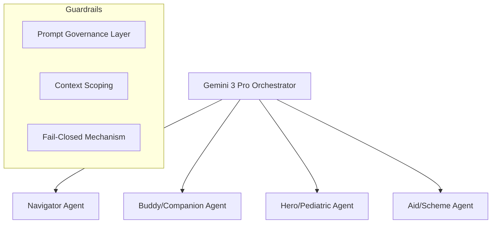
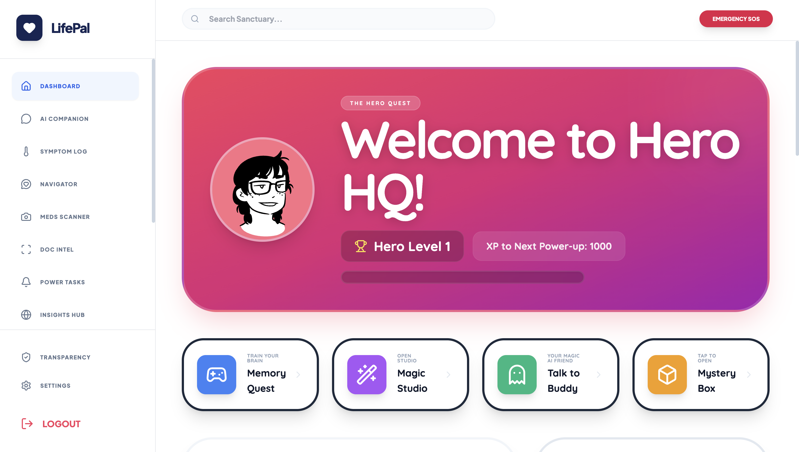

# LifePal: Systems Architecture and Clinical Support Infrastructure

An offline-first, AI-augmented clinical support sanctuary for longitudinal oncology care

### 🔗 Navigation
[Features](#features) ·
[Architecture](#system-architecture) ·
[Documentation](#171-documentation) ·
[Contributing](#17-contributing)

---

## 📑 Table of Contents

- [1. Executive Overview](#1-executive-overview)
  - [1.1 Features](#11-features)
  - [1.2 System Architecture](#12-system-architecture)
- [2. Problem Space and Motivation](#2-problem-space-and-motivation)
  - [2.1 Ecosystem Fragmentation](#21-ecosystem-fragmentation)
  - [2.2 Informational Asymmetry](#22-informational-asymmetry)
  - [2.3 The Caregiver Load Crisis](#23-the-caregiver-load-crisis)
  - [2.4 Pediatric Comprehension Gaps](#24-pediatric-comprehension-gaps)
  - [2.5 Regional Inequity](#25-regional-inequity)
- [3. Design Philosophy](#3-design-philosophy)
  - [3.1 Safety-First Engineering](#31-safety-first-engineering)
  - [3.2 Offline-First Durability](#32-offline-first-durability)
  - [3.3 Privacy as an Architectural Constraint](#33-privacy-as-an-architectural-constraint)
  - [3.4 Assistive AI vs. Authoritative AI](#34-assistive-ai-vs-authoritative-ai)
- [4. Conceptual Model of LifePal](#4-conceptual-model-of-lifepal)
  - [4.1 System Actors](#41-system-actors)
  - [4.2 Boundaries of Operation](#42-boundaries-of-operation)
- [5. System Architecture](#5-system-architecture)
  - [5.1 High-Level System Architecture](#51-high-level-system-architecture)
  - [5.2 Component-Level Architecture](#52-component-level-architecture)
  - [5.3 Execution Lifecycle](#53-execution-lifecycle)
  - [5.4 Safety and Trust Boundaries](#54-safety-and-trust-boundaries)
  - [5.5 Offline-Only vs. Online-Augmented Paths](#55-offline-only-vs-online-augmented-paths)
- [6. Core Subsystems](#6-core-subsystems)
  - [6.1 User Role and Context Resolution](#61-user-role-and-context-resolution)
  - [6.2 Offline Storage and Sync Engine](#62-offline-storage-and-sync-engine)
  - [6.3 Clinical Navigation Support Module](#63-clinical-navigation-support-module)
  - [6.4 Emotional Support and Coping Assistance](#64-emotional-support-and-coping-assistance)
  - [6.5 Pediatric Interaction and Gamified Learning](#65-pediatric-interaction-and-gamified-learning)
  - [6.6 Caregiver Load and Burnout Awareness](#66-caregiver-load-and-burnout-awareness)
  - [6.7 Regional Aid and Scheme Discovery](#67-regional-aid-and-scheme-discovery)
- [7. AI Agent Architecture and Reasoning Model](#7-ai-agent-architecture-and-reasoning-model)
  - [7.1 Agent Isolation](#71-agent-isolation)
  - [7.2 Prompt Governance](#72-prompt-governance)
- [8. Offline-First Data and Sync Theory](#8-offline-first-data-and-sync-theory)
  - [8.1 Criticality of Localism](#81-criticality-of-localism)
  - [8.2 Event Queues and Conflict Resolution](#82-event-queues-and-conflict-resolution)
- [9. Security, Privacy and Data Minimization](#9-security-privacy-and-data-minimization)
  - [9.1 Local-First Ownership](#91-local-first-ownership)
  - [9.2 Secrets Management](#92-secrets-management)
- [10. Pediatric Safety and Ethical Constraints](#10-pediatric-safety-and-ethical-constraints)
- [11. Caregiver Burnout Detection Theory](#11-caregiver-burnout-detection-theory)
- [12. Survivor Lifecycle Support Model](#12-survivor-lifecycle-support-model)
- [13. Deployment and Infrastructure](#13-deployment-and-infrastructure)
- [14. Extensibility and Evolution](#14-extensibility-and-evolution)
- [15. Use Cases](#15-use-cases)
- [16. Known Limitations and Tradeoffs](#16-known-limitations-and-tradeoffs)
- [17. Contributing](#17-contributing)
  - [17.1 Documentation](#171-documentation)
- [18. Check Out LifePal](#18-check-out-lifepal)
  - [18.1 Team Members](#181-team-members)
- [19. License](#19-license)

## 1. Executive Overview

LifePal is a distributed, AI-augmented infrastructure designed to bridge the structural gaps in longitudinal oncology care. It operates as a digital sanctuary that provides continuous clinical navigation, emotional mirroring, and logistical coordination for stakeholders within the cancer care ecosystem.

## 1.1 Features

-  **Assistive AI by Design**  
  Generative intelligence operates strictly as a cognitive assistant — summarization, translation, mirroring, and safe escalation only. No clinical decisions are ever made by AI.

-  **Clinical Navigation Support**  
  Helps patients and caregivers understand care pathways, terminology, and next steps without replacing medical professionals.

-  **Pediatric-Safe Interaction Layer**  
  Age-aware explanations and gamified learning experiences designed with strict ethical and safety constraints.

-  **Caregiver Load Awareness**  
  Tracks capacity signals and provides burnout-aware nudges and resources.

-  **Regional Aid & Scheme Discovery**  
  Contextual discovery of government and non-profit support programs.

-  **Offline-First Architecture**  
  Core functionality remains available without connectivity, ensuring reliability in low-infrastructure settings.

-  **Privacy-First by Architecture**  
  Local-first data ownership with minimal cloud exposure and explicit trust boundaries.

## 1.2 System Architecture

At its core, LifePal addresses the class of problems known as the clinical silence—the high-risk period between episodic hospital treatments where patients and caregivers must manage complex recovery protocols without real-time professional oversight. The system is designed to serve five primary actors: adult patients, pediatric patients, primary caregivers, survivors, and institutional donors.

LifePal is defined as a non-diagnostic support system. It leverages generative reasoning engines and multimodal vision models to translate clinical documentation into actionable roadmaps, ensuring that institutional protocols—specifically those grounded in the Aligarh Muslim University JNMCH radiotherapy guidelines—are accessible at the point of care.

## 2. Problem Space and Motivation

The current oncology landscape suffers from systemic fragmentation. This document identifies and addresses several critical failure points in existing care models.

### 2.1 Ecosystem Fragmentation
Cancer treatment is episodic, yet the disease is continuous. Current EHR systems focus on intra-hospital data points, leaving the home environment as a data vacuum. This lack of continuity leads to sub-optimal compliance with anti-emetic schedules and delayed identification of neutropenic emergencies.

### 2.2 Informational Asymmetry
Patients are frequently overwhelmed by jargon-heavy documentation. This cognitive load, compounded by the physiological effects of chemotherapy, creates an informational barrier that prevents patients from participating effectively in their own care navigation.

### 2.3 The Caregiver Load Crisis
Primary caregivers operate as the silent infrastructure of oncology. The lack of a structured monitoring system for caregiver resilience leads to invisible burnout, which clinically correlates with degraded patient outcomes and family unit collapse.

### 2.4 Pediatric Comprehension Gaps
Traditional clinical communication is terrifying for children. The absence of age-appropriate, metaphor-driven interaction models leads to treatment resistance and long-term psychological trauma in pediatric wards.

### 2.5 Regional Inequity
In regional contexts, access to financial aid schemes like Ayushman Bharat or RAN is often blocked by bureaucratic friction rather than eligibility. There is a systemic need for a localized discovery engine that automates the mapping of clinical status to institutional relief.

## 3. Design Philosophy

LifePal is built upon four fundamental architectural pillars.

### 3.1 Safety-First Engineering
The system assumes that any unconstrained AI output in a medical context is a potential risk. Therefore, LifePal utilizes a governance layer that enforces strict boundaries: no diagnosis, no dosage modification, and mandatory institutional grounding.

### 3.2 Offline-First Durability
Recognizing that oncology patients are often in signal-shielded hospital environments or rural regions with high network latency, LifePal treats the internet as a transient enhancement rather than a requirement. All core clinical ledgers reside on the local device.

### 3.3 Privacy as an Architectural Constraint
Dignity is treated as a functional requirement. The system employs a data minimization strategy where the most sensitive psychological data never leaves the edge device. Cloud-based reasoning is performed on redacted, anonymized clinical fragments.

### 3.4 Assistive AI vs. Authoritative AI
The system positions generative intelligence as a cognitive assistant. AI agents are prohibited from making clinical decisions. Their role is restricted to summarization, translation, mirroring, and escalation to human professionals.

## 4. Conceptual Model of LifePal

The system operates as a polymorphic environment that mutates based on the resolved actor role.

### 4.1 System Actors
*   Patient: The primary consumer of navigation and symptom monitoring.
*   Child: Interacts with a gamified, metaphor-rich abstraction of the system.
*   Caregiver: Manages logistics and monitors personal resilience capacity.
*   Survivor: Engages in long-term vigilance and post-cancer thriving protocols.
*   Donor: Interfaces with a transparency layer to witness direct social impact.

### 4.2 Boundaries of Operation
LifePal intentionally avoids the following domains:
1.  Primary Diagnosis: The system will never interpret symptoms to identify disease presence.
2.  Prescription Modification: The system will never suggest changes to drug types or quantities.
3.  EHR Source of Truth: LifePal acts as a shadow ledger for the patient; it does not replace official hospital records.

## 5. System Architecture

### 5.1 High-Level System Architecture

The architecture follows a tiered Hybrid-Edge-Cloud model.

This structure ensures that the client remains functional during network partitions. The Gateway Proxy serves as a security air-gap, preventing client-side code from interacting directly with model keys or unredacted infrastructure.

### 5.2 Component-Level Architecture

The frontend is structured as a state-orchestrated polymorphic application.

The State Orchestrator manages the transition between different role-based views while the Sync Manager ensures eventual consistency with the cloud vault using an append-only ledger strategy.

### 5.3 Execution Lifecycle

When a user interacts with the system, the lifecycle follows a strict path to ensure data integrity.

1.  Interaction: User inputs a symptom or uploads a report.
2.  Local Persistence: Data is encrypted and written to IndexedDB immediately.
3.  UI Update: The interface reflects the change optimistically.
4.  Event Queue: The Sync Manager adds the action to a pending queue.
5.  Gateway Transmission: Upon network availability, a redacted payload is sent to the Gateway Proxy.
6.  AI Augmentation: Specialized agents process the data.
7.  Augmented Update: The local record is updated with AI insights (e.g., term explanations).

### 5.4 Safety and Trust Boundaries

LifePal implements a zero-trust model between the client and the AI models.

The validation token ensures that the response originated from the trusted proxy and has passed the internal safety filters.

### 5.5 Offline-Only vs. Online-Augmented Paths

| Feature | Offline Behavior | Online Enhancement |
| :--- | :--- | :--- |
| Symptom Logging | Full ledger persistence | Pattern analysis and clinical alerts |
| Med Scanner | Image capture and local storage | Vision-AI identification and interaction checks |
| Doc Intel | Encrypted storage and manual tags | OCR summarization and term clarification |
| Hero HQ | Full quest state and sticker vault | Generative storytelling and cinema sync |
| Navigator | Cached roadmaps | Dynamic strategy generation via Search |

## 6. Core Subsystems

### 6.1 User Role and Context Resolution
This subsystem identifies the cognitive and emotional requirements of the user. It resolves the actor type upon onboarding and maintains a context object that includes language preferences (Hindi, Urdu, Telugu, English) and current emotional state.

### 6.2 Offline Storage and Sync Engine
Built on top of IndexedDB, this engine manages multi-gigabyte medical document blobs. It uses a causal consistency model to resolve conflicts between multiple caregivers updating the same patient record.

### 6.3 Clinical Navigation Support Module
This module provides the strategic roadmap for treatment. It consumes clinical identifiers and financial status to produce a list of institutional next steps. Failure mode: If clinical status is ambiguous, it reverts to a hardcoded list of standard AMU protocols.

### 6.4 Emotional Support and Coping Assistance
Utilizing Native Audio processing, this subsystem provides therapeutic mirroring. It detects crisis signals in user speech or text and immediately triggers the SOS Emergency Protocol, bypassing the AI entirely.

### 6.5 Pediatric Interaction and Gamified Learning
Hero HQ translates clinical reality into metaphors. XP, levels, and mystery boxes serve as incentives for hydration and rest. Safety guarantee: All pediatric AI sessions are time-limited and summarized for the guardian.

### 6.6 Caregiver Load and Burnout Awareness
This module analyzes sentiment trends in caregiver journals and monitors metric consistency. It employs a Resilience Capacity model to suggest task hand-offs to the care network when stress thresholds are exceeded.

### 6.7 Regional Aid and Scheme Discovery
Using Search Grounding, this system navigates the bureaucracy of Indian national and regional schemes. It provides a specific document checklist for each scheme to reduce application rejection rates.

## 7. AI Agent Architecture and Reasoning Model

LifePal employs a multi-agent specialized architecture.

### 7.1 Agent Isolation
Each agent is provided with a distinct system instruction envelope. The Hero Agent, for instance, has zero visibility into the financial aid logic to prevent exposing children to adult stressors.

### 7.2 Prompt Governance
All interactions are wrapped in a system prompt that mandates the use of devnagari for Hindi, nastaliq for Urdu, and ensures that the AI never attempts to override the authority of a medical professional.

## 8. Offline-First Data and Sync Theory

### 8.1 Criticality of Localism
In oncology care, losing access to a medication schedule because of a server outage is a clinical risk. LifePal's architecture ensures that the source of truth is always the device in the patient's hand.

### 8.2 Event Queues and Conflict Resolution
The system treats every user action as an immutable event.
*   Metadata updates: Last-Write-Wins.
*   Clinical logs: Vector clock-based merge.
*   Document uploads: Checksum verification to prevent duplicates.

## 9. Security, Privacy and Data Minimization

### 9.1 Local-First Ownership
The encryption keys for the clinical ledger are derived from the user's LifePal PIN and stored in the device's secure enclave. LifePal infrastructure never possesses the keys required to decrypt the local symptom logs.

### 9.2 Secrets Management
Infrastructure secrets, including Google Gemini API keys, are rotated every 30 days via Microsoft Key Vault. The client-side code never handles raw keys; all communication is signed by a short-lived token provided by the Gateway Proxy.

## 10. Pediatric Safety and Ethical Constraints

The pediatric model is governed by the principle of protective abstraction.

1.  Language Simplification: Clinical terms are replaced by metaphors (e.g., Magic Juice for Chemotherapy).
2.  Guardian Interlock: Caregivers must approve the activation of Hero HQ and can review all AI-led storytelling.
3.  Content Boundaries: The pediatric agent is hard-coded to ignore any prompts related to prognosis or mortality.

## 11. Caregiver Burnout Detection Theory

Burnout is modeled as a degradation of consistency. The system looks for:
*   Increased sentiment intensity in private journals.
*   Gaps in medication reminders (neglect signals).
*   High frequency of overwhelmed mood logs.

Escalation is gentle. The system does not notify the patient—avoiding patient guilt—but instead triggers an alert for the Backup Care Network.

## 12. Survivor Lifecycle Support Model

The transition to remission is a psychological desert. LifePal maintains engagement through:
*   Vigilance logs: Structured monthly check-ins to monitor for recurrence markers.
*   Thriving protocols: Evidence-based lifestyle guidance for post-cancer health.
*   Meetup coordination: Linking survivors to regional support circles in Western UP.

## 13. Deployment and Infrastructure

LifePal is deployed as a globally distributed PWA.

*   Frontend: React/Vite/TypeScript hosted on Vercel Edge.
*   Gateway: Vercel Edge Functions for low-latency PII scrubbing.
*   Cloud Persistence: Azure Private Blobs for encrypted document archives.
*   Database: Cosmos DB for aggregated, anonymized social impact metrics.

## 14. Extensibility and Evolution

The role-based architecture allows for the future addition of specialized roles:
*   Palliative Nurse Role: For managing end-of-life comfort protocols.
*   Clinical Research Role: For patient-approved, anonymized data contribution to oncology studies.
*   Physiotherapist Role: For guided recovery movements.

## 15. Use Cases

### 15.1 Patient Daily Navigation
Ramesh, a colon cancer patient at JNMCH, uses the Med Scanner to identify his morning tablets and logs a level 6 pain event. The AI Navigator suggests he mentions this at his Thursday appointment.

### 15.2 Caregiver Coordination
Anita uses the Anchor Hub to coordinate her brother driving Ramesh to Aligarh. She logs her own tiredness, and the system suggests she takes a 15-minute rest while the brother is on duty.

### 15.3 Pediatric Empowerment
Zoya, age 7, finishes her Quest for Water. She earns a Legendary Sticker and watches a Brave Knight story in the Hero Cinema to distract her from the metallic taste of her medicine.

## 16. Known Limitations and Tradeoffs

1.  Latency: High-fidelity reasoning via Gemini Pro can take up to 5 seconds. The system uses a shimmering UI state to manage user anxiety during this window.
2.  Non-Medical Device: LifePal is not a regulated medical device and should never be used as the sole basis for clinical decisions.
3.  Hardware Dependency: The quality of the Med Scanner is bounded by the user's device camera resolution.

## 17. Contributing

LifePal is a mission-driven project. We expect contributors to adhere to a strict Sanctuary Code of Conduct.

*   Clinical contributions must be grounded in verified oncology protocols.
*   AI safety contributions should focus on improving hallucination detection and PII scrubbing.
*   Design contributions must prioritize cognitive ease for patients in active treatment.
## 17.1 Documentation

LifePal’s documentation is detailed, theory-backed, and structured to cover **architectural, ethical, and operational aspects** of the system.

### Primary Documentation Hub

- **LifePal Notion Workspace**  
  [LifePal Documentation (Notion)](https://www.notion.so/LifePal-An-All-in-One-Cancer-Care-Sanctuary-2d7f7dee167380f8acfdf311ec3050ab)

This is the central hub for all LifePal documentation, including system design, AI agent details, and operational guidelines.

---

### Core Topics

#### Design Philosophy
LifePal is built on **safety-first, offline-first, and privacy-first principles**.

- **Practical Architecture Principles**  
  [https://martinfowler.com/articles/practical-architecture.html](https://martinfowler.com/articles/practical-architecture.html)
- **Progressive Web Apps Overview**  
  [https://web.dev/progressive-web-apps/](https://web.dev/progressive-web-apps/)

---

#### System Architecture
LifePal uses **component isolation**, **trust boundaries**, and **offline-first execution** to ensure reliability and privacy.

- **React Component-Based Architecture**  
  [https://react.dev/learn](https://react.dev/learn)
- **PWA & Offline Capabilities**  
  [https://developer.mozilla.org/en-US/docs/Web/Progressive_web_apps](https://developer.mozilla.org/en-US/docs/Web/Progressive_web_apps)
- **Mermaid Diagram Reference for Architecture**  
  [https://mermaid.js.org/](https://mermaid.js.org/)

---

#### AI Agent Model
LifePal’s AI is **assistive and non-authoritative**, designed to support users without making clinical decisions.

- **WHO Guidelines on AI in Healthcare**  
  [https://www.who.int/publications/i/item/WHO-RHR-22.07](https://www.who.int/publications/i/item/WHO-RHR-22.07)
- **UNESCO Report on AI Ethics**  
  [https://unesdoc.unesco.org/ark:/48223/pf0000381137](https://unesdoc.unesco.org/ark:/48223/pf0000381137)

---

#### Security and Privacy
LifePal prioritizes **data minimization, local-first ownership**, and strict privacy guarantees.

- **OWASP Top Ten Security Risks**  
  [https://owasp.org/www-project-top-ten/](https://owasp.org/www-project-top-ten/)
- **GDPR Overview**  
  [https://gdpr.eu/](https://gdpr.eu/)
- **Best Practices for Local-First Apps**  
  [https://web.dev/local-first/](https://web.dev/local-first/)

---

#### Deployment and Hosting
LifePal is hosted on **Vercel** with **edge-optimized delivery** and support for offline usage.

- **Vercel Documentation**  
  [https://vercel.com/docs](https://vercel.com/docs)
- **Continuous Deployment Practices**  
  [https://docs.github.com/en/actions](https://docs.github.com/en/actions)

---

#### Additional Resources
- **Accessibility & Inclusive Design Principles**  
  [https://www.w3.org/WAI/](https://www.w3.org/WAI/)
- **Healthcare Data Standards & Interoperability**  
  [https://www.hl7.org/](https://www.hl7.org/)
- **React + PWA Example Projects**  
  [https://github.com/topics/pwa](https://github.com/topics/pwa)

---

> **Note:** Refer to the **LifePal Notion Workspace** for in-depth guidelines, diagrams, and workflow explanations. This section serves as a quick-access reference to primary sources and best practices.

## 18. 🔗 Check Out LifePal

- **Live App:** [Click here to view LifePal live](https://lifepal.vercel.app)  
- **Demo Pitch:** [Click here to watch the pitch](https://vimeo.com/1152650698?share=copy&fl=sv&fe=ci)  
- **Video Demo:** [Click here to watch the app demo](https://vimeo.com/1152650698?share=copy&fl=sv&fe=ci)  

---

## 18.1 👥 Team Members

- **Sadia Peerzada** – Team Lead & Back-end
- **Sadia Zafreen** – Front-end  
- **Alisha Hasan** – System Architecture  
- **Hania Hayat** – Research
  
## 19. License

LifePal is licensed under the **MIT License**. You are free to use, copy, modify, and distribute this software, provided you include this copyright notice.  
See the full license details in [LICENSE](LICENSE).

> Stay Brave. Logic as the Weapon, Compassion as the Shield.

